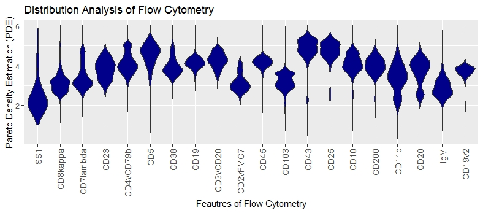
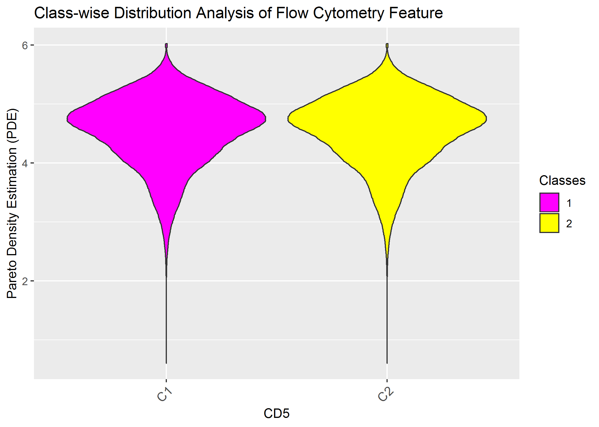
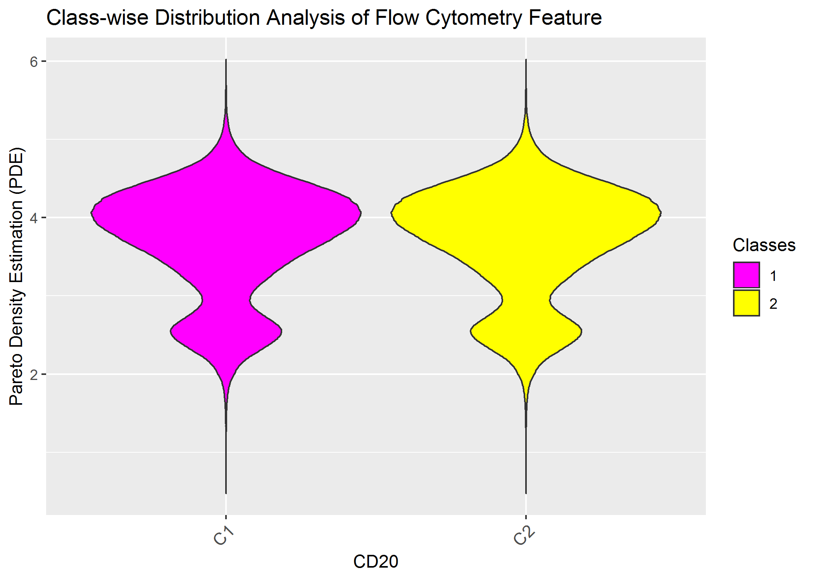
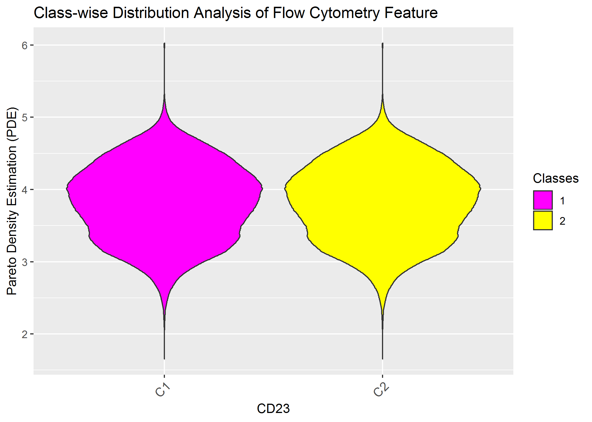
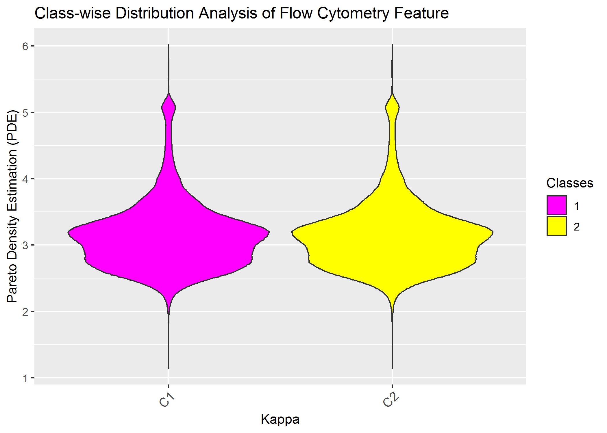
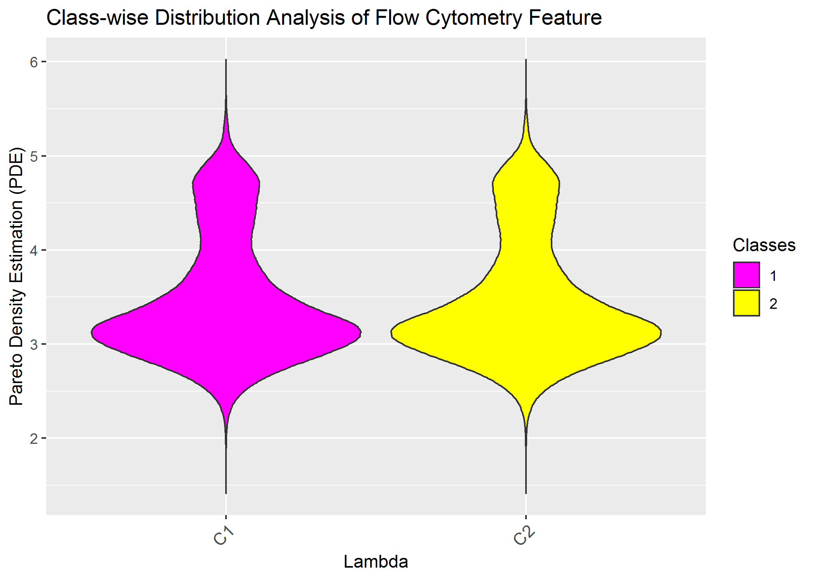
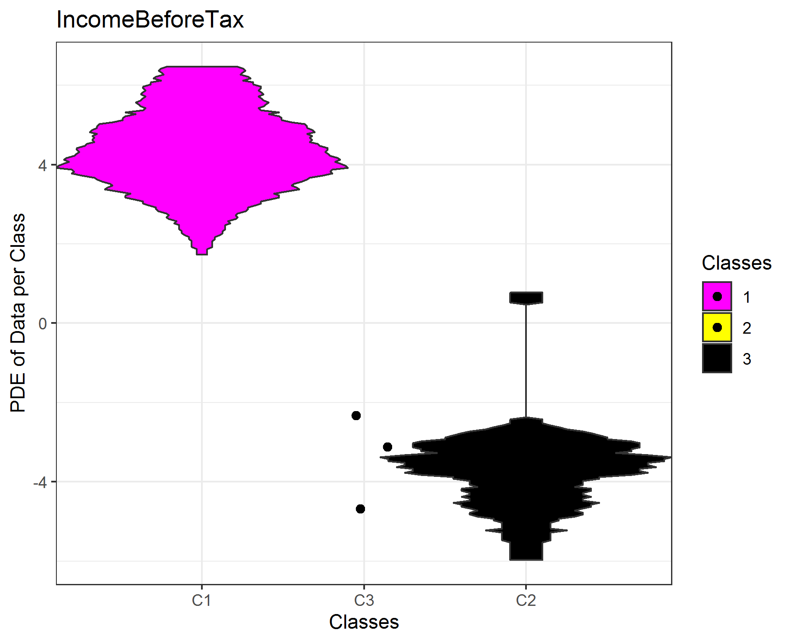
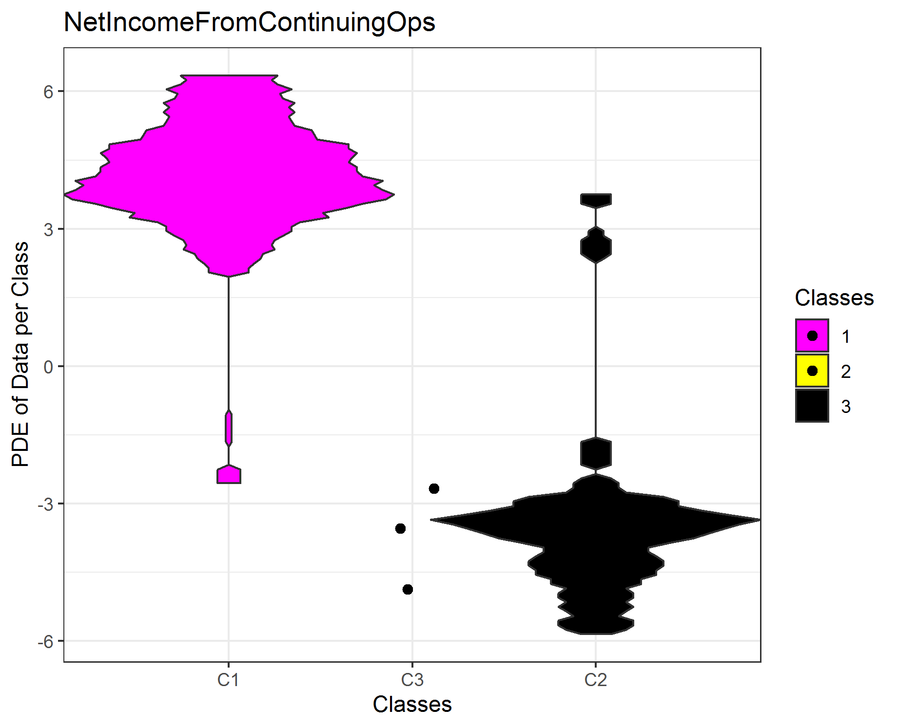
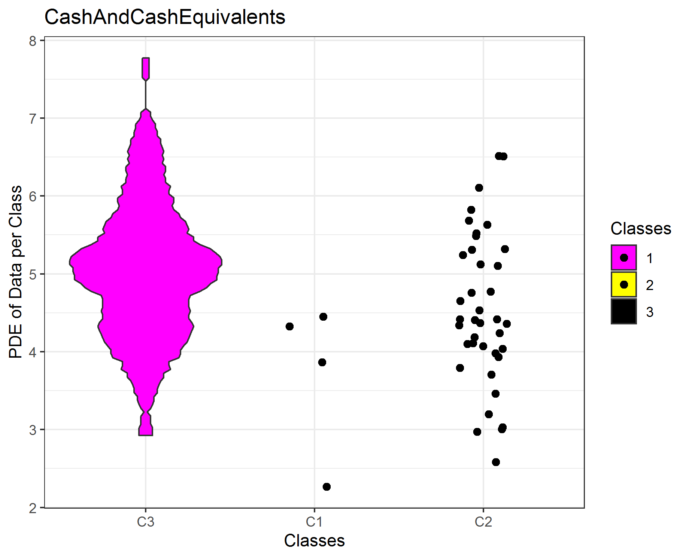
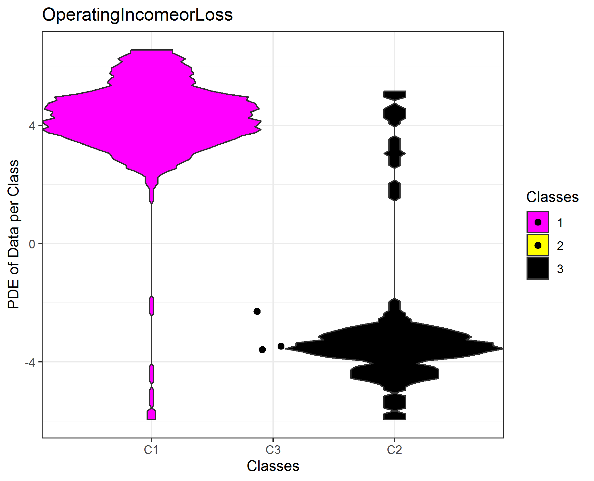

# Example Applications

- Distribution Analysis of Flow Cytometry Big Data for the Detection of Lymphoma
- Investigation of High-Dimensional Accounting Information with the Goal to Explain Clusters

## Content of Flow Cytometry Data

Multiparameter flow cytometry is an immunologically based standard diagnostic procedure in oncology. It requires special medical knowledge in analysis and interpretation and a very extensive data aquisition. The knowledge of performing a manual analysis must be acquired in addition to the clinical background over several years of training. The method is of great clinical value for the care of oncological patients due to its simple application and high measuring speed compared to molecular genetic methods. We will show here, that there are infact obvious differences between ill and healthy patients if the MD plot is used.

## Data of Flow Cytometry
The procedures of reading data can be found in https://rdrr.io/github/aultsch/DataIO/. Unfortunatly, the dataset and prior classification cannot be provided as long as this is an going research project. Additonally, we use a random sample. In the next lines we load the data, check that the key of the cases is the same between prior classification and data matrix and show the dimensionality of the data set. 

```r
library(dbt.DataIO)
Path=ReDi("MirroredDensityPlot2019/09Originale",'F')
setwd(Path)
V=ReadLRN('01HealthyandCLLRandomSamplesC20n328000')
Data=V$Data
Key=V$Key
V=ReadCLS('02HealthyandCLLRandomSamplesN328000')
ClsKey=V$ClsKey
Cls=V$Cls
#Is Key the same?
dbt.ClassAnalysis::TheSameKey(ClsKey,Key)
#Big Data
dim(Data)
```

## MD-plot

The Mirrored-Density plot (MD plot) can be used with an prior classification if one is interested in the differences between classes. The differences are here interesting, because they can be exploited for detection purposes.

The MDplot uses the syntax of ggplot2.

```r
library(DataVisualizations)
MDplot(Data,Ordering = 'Columnwise')+ggtitle('Distribution Analysis of Flow Cytometry')+xlab('Feautres of Flow Cytometry')+ylab('Pareto Density Estimation (PDE)')
```


No feature is overlayed with with a roubustly estimated unimodal Gaussian distribution  in magenta, meaning that statistical testing showed a significant difference.

Multimodality (more than one hill) is visible in the features: CD20,CD7lambda,CD4vCD79b, CD2vFMC7, CD103, CD43, CD25, CD10, CD11c

Skewness is visible in the features: SS1,CD8kappa, CD23, CD7lambda, CD5, CD38, CD11c, igM

No Data clipping is visible.

## Class-wise MD plot for 1. Application
An follow up question could be if we are able to distinguish ill from healthy patients by features, if a prior classification is given.
We select features which are used in current panels. 

```r
library(DataVisualizations)

ClassMDplot(Data[,'CD5'],Cls)$ggobject+ggtitle('Class-wise Distribution Analysis of Flow Cytometry Feature')+xlab('CD5')+ylab('Pareto Density Estimation (PDE)')

ClassMDplot(Data[,'CD20'],Cls)$ggobject+ggtitle('Class-wise Distribution Analysis of Flow Cytometry Feature')+xlab('CD20')+ylab('Pareto Density Estimation (PDE)')

ClassMDplot(Data[,'CD23'],Cls)$ggobject+ggtitle('Class-wise Distribution Analysis of Flow Cytometry Feature')+xlab('CD23')+ylab('Pareto Density Estimation (PDE)')

ClassMDplot(Data[,'CD8kappa'],Cls)$ggobject+ggtitle('Class-wise Distribution Analysis of Flow Cytometry Feature')+xlab('Kappa')+ylab('Pareto Density Estimation (PDE)')

ClassMDplot(Data[,'CD7lambda'],Cls)$ggobject+ggtitle('Class-wise Distribution Analysis of Flow Cytometry Feature')+xlab('Lambda')+ylab('Pareto Density Estimation (PDE)')

```






Of course we do not see any difference because the data was not gated priorly and because one feauture alone is insufficent.

## Content of High-Dimensional Accounting Information
We use a clustering of manuscript currently under review [Thrun/Ultsch, 2019] in order to show that the the high-dimensional clustering can be distinguished by one single feature. The data consists of Aaccounting information of 261 companies traded in the Frankfurt stock exchange in the German Prime standard. We select four features which are understandable (details, see [Thrun/Ultsch, 2019]) when published. 

## Class-wise MD plot for 2. Application Explains Clustering

The first feature is clearly seperated by the clustering, the other three features are not completly seperated. If not enough data is available for the estimation of the probability density function (pdf), scatter plots are drawn. In sum, the clustering of the high-dimensional data set of 45 features can be explained by one single feature afterwards if outliers are disregarded (cluster 3)!

```{r}
data('AccountingInformation_PrimeStandard_Q3_2019.rda')
str(AI_PS_Q3_2019)
Data=AI_PS_Q3_2019$Data
Cls=AI_PS_Q3_2019$Cls

NamesTarget=c('IncomeBeforeTax','NetIncomeFromContinuingOps',"CashAndCashEquivalents","OperatingIncomeorLoss")
TargetFeatures=DataVisualizations::SignedLog(Data[,match(table = colnames(Data),NamesTarget)])

i=1
ClassMDplot(TargetFeatures[,i],Cls,main = colnames(TargetFeatures)[i])$ggobject+theme_bw()
#ggsave(filename=paste0(colnames(TargetFeatures)[i],'.png'))

i=2
ClassMDplot(TargetFeatures[,i],Cls,main = colnames(TargetFeatures)[i])$ggobject+theme_bw()
#ggsave(filename=paste0(colnames(TargetFeatures)[i],'.png'))

i=3
ClassMDplot(TargetFeatures[,i],Cls,main = colnames(TargetFeatures)[i])$ggobject+theme_bw()
#ggsave(filename=paste0(colnames(TargetFeatures)[i],'.png'))

i=4
ClassMDplot(TargetFeatures[,i],Cls,main = colnames(TargetFeatures)[i])$ggobject+theme_bw()
#ggsave(filename=paste0(colnames(TargetFeatures)[i],'.png'))

```





[Thrun/Ultsch, 2019] Thrun, M. C., & Ultsch, A.: Stock Selection via Knowledge Discovery using Swarm Intelligence with Emergence, IEEE Intelligent Systems, Vol. under review, pp., 2019.
