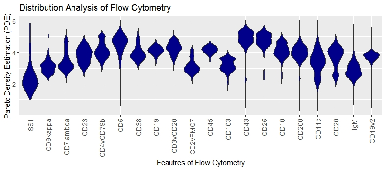

# Distribution Analysis of Flow Cytometr

## Content of Data

Multiparameter flow cytometry is an immunologically based standard diagnostic procedure in oncology. It requires special medical knowledge in analysis and interpretation and a very extensive data aquisition. The knowledge of performing a manual analysis must be acquired in addition to the clinical background over several years of training. The method is of great clinical value for the care of oncological patients due to its simple application and high measuring speed compared to molecular genetic methods. We will show here, that there are infact obvious differences between ill and healthy patients if the MD plot is used.

## Data of Flow Cytometry
The procedures of reading data can be found in https://rdrr.io/github/aultsch/DataIO/. Unfortunatly, the dataset and prior classification cannot be provided as long as this is an going research project. Additonally, we use a random sample. In the next lines we load the data, check that the key of the cases is the same between prior classification and data matrix and show the dimensionality of the data set. 

```r
library(dbt.DataIO)
Path=ReDi("MirroredDensityPlot2019/09Originale",'F')
setwd(Path)
V=ReadLRN('01HealthyandCLLRandomSamplesC20n328000')
Data=V$Data
Key=V$Key
V=ReadCLS('02HealthyandCLLRandomSamplesN328000')
ClsKey=V$ClsKey
Cls=V$Cls
#Is Key the same?
dbt.ClassAnalysis::TheSameKey(ClsKey,Key)
#Big Data
dim(Data)
```

## MD-plot

The Mirrored-Density plot (MD plot) can be used with an prior classification if one is interested in the differences between classes. The differences are here interesting, because they can be exploited for detection purposes.

The MDplot uses the syntax of ggplot2.

```r
library(DataVisualizations)
MDplot(Data,Ordering = 'Columnwise')+ggtitle('Distribution Analysis of Flow Cytometry')+xlab('Feautres of Flow Cytometry')+ylab('Pareto Density Estimation (PDE)')
```


No feature is overlayed with with a roubustly estimated unimodal Gaussian distribution  in magenta, meaning that statistical testing showed a significant difference.

Multimodality (more than one hill) is visible in the features: CD20,CD7lambda,CD4vCD79b, CD2vFMC7, CD103, CD43, CD25, CD10, CD11c

Skewness is visible in the features: SS1,CD8kappa, CD23, CD7lambda, CD5, CD38, CD11c, igM

No Data clipping is visible.
