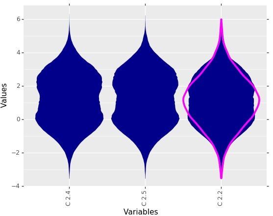

# Python Package

## Installation

The latest stable release can be installed from PyPi:

```sh
pip install md_plot
```

The source code is hosted on GitHub at: https://github.com/TinoGehlert/md_plot

## Dependencies

- Python 3.5+
- [pandas](https://pandas.pydata.org): 0.24.2 or higher
- [NumPy](http://www.numpy.org): 1.16.0 or higher
- [scipy](https://www.scipy.org/): 1.1.0 or higher
- [matplotlib](https://matplotlib.org/): 3.1.0 or higher
- [plotnine](https://plotnine.readthedocs.io/en/stable/): 0.5.1 or higher
- [unidip](https://github.com/BenjaminDoran/unidip/): 0.1.1 or higher

Windows users of Anaconda distribution should update numpy, scipy and matplotlib via conda instead of pip.

## Basic Usage

```python
from md_plot import MDplot, load_examples

dctExamples = load_examples()

MDplot(dctExamples["BimodalArtificial"])
```



## Future Improvements

In addition to bug fixing, these improvements to the md_plot pack-age are planned:
- Close the performance gap to the R version
- Reimplementation of dip-test based on diptest R package (uni-dip is using Monte Carlo simulations to compute the p-values, but this is not the default behavior of the diptest in R)
