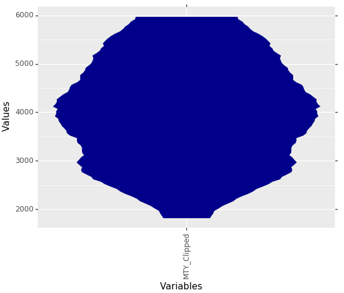

# Python Tutorial

## Introduction

In data analysis of industrial topics such as the quality assurance of production facilities or the analysis of customer behavior, we constantly encounter univariate distributions of all kinds. From unimodal Gaussians to symmetric or skewed distributions to multimodal distributions It is of immense importance to determine the exact shape of the distribution in order to be able to select the correct further analysis steps and to be able to draw correct conclusions. Of special interest is the question, whether the given empirical distribution is composed of two or more distinct subsets of data points. Such subsets give hints to the existence of different states of the data producing process, such as, for example, healthy vs. sick patients or the existence of different diseases or treatments.  

Conventional visualization methods of univariate probability density distributions have problems in the distinction of uniform versus multi-modal distributions and in visualizing capped skewed distributions correctly. With the mirrored density plot, a visualization method more suit-able for these applications was postulated [Thrun/Ultsch, 2019] in the programming language R, which is now extended to python. 

The Python package _md_plot_ is an implementation of the MD-Plot function of the R package _DataVisualizations_ on CRAN [Thrun/Ultsch, 2018]. The use of the package is described in this technical report.

## Basic Usage

### Inbuild Samples

The md_plot package offers several samples to make getting started using the MD-Plot easier. To do this, call the function load_examples, which returns a dictionary. This dictionary contains several keys, which each provide access to a single pandas dataframe.

```python
from md_plot import load_examples
dctExamples = load_examples()
```


_**Fig. 1:** Return of the load_examples function. The sample data is contained in a dictionary as pandas dataframes and can be used in the MDplot to reproduce the visualizations._

These dataframes can now be used in the md_plot function.

### Visualization

The MDplot function of the md_plot package accepts pandas series (vectors) and pandas dataframes (matrices) or anything that converts simply into these two data structures (for example, lists and numpy ar-rays) as input. Preprocessing depending on the analysis can be before done before visualization. For example the capping of values:

```python
from md_plot import MDplot
dfMTY = dctExamples["MTY_Clipped"]
dfMTY = dfMTY[(dfMTY["MTY_Clipped"] >= 1800) & (dfMTY["MTY_Clipped"] <= 6000)]
MDplot(dfMTY)
```


_**Fig. 2:** MD-Plot of capped municipality income tax yield (MTY) of Germany municipalities of 2015. Good to see are the clear capping limits at which the were cropped for the visualization._

The function returns a ggplot object, but you can get additional in-formation by setting the _OnlyPlotOutput_ parameter to False.

```python
dctResult = MDplot(dctExamples['BimodalArtificial'], OnlyPlotOutput=False)
```

### Working with long table format

The MDplot function accepts by default data in wide table format (each column represents one variable), but can also work with data in long table format (the values of all variables are contained in one column, a second column with identifiers exist) if the column names of the value column and the class column are provided.

```python
MDplot(dctExamples["SkewedDistributionLongTable"], ValueColumn="value", ClassColumn="class")
```

### Changing Layout

The layout of the ggplot object returned by the MDplot can be modi-fied by adding additional ggplot objects, e.g. a title.

```python
import plotnine as p9
MDplot(dfMTY) + p9.labels.ggtitle('Capped MTY data') + p9.labels.ylab('PDE') + p9.labels.xlab('Variables') + p9.theme_seaborn()
```


_**Fig. 3:** MD plot of capped MTY data with title, changed axis labels and in seaborn theme_

Further information on the layout design of ggplots in plotnine can be found in the official documentation at https://plotnine.readthedocs.io.

## Advanced Usage

### Draw a Gaussian distribution

The parameter _RobustGaussian_ is used to activate or deactivate an overlay of a Gaussian distribution (this activated by default). The Gaussian distribution will only be drawn if several statistical tests have shown that the data is unimodal and not skewed. For changing the vis-ual appearance of the Gaussian distribution, the parameters _Gaussian-Color_ and _GaussianLwd_ (line width) are provided.

```python
MDplot(dctExamples['BimodalArtificial'], RobustGaussian=False)
```


_**Fig. 4:** Visualization of bimodal data without drawn Gaussian distribution._

```python
MDplot(dctExamples['BimodalArtificial'], GaussianColor='green', GaussianLwd=2.5)
```


_**Fig. 5:** Visualization of bimodal data with a drawn Gaussian distribution._

### Draw a Box Plot

The parameters _BoxPlot_ (deactivated by default) and _BoxColor_ are used for plotting a boxplot over each MD-Plot.

```python
MDplot(dctExamples['UniformSample'], BoxPlot = True)
```


_**Fig. 6:** Uniformly distributed data with drawn Box Plot. The Box Plot alone would suggest a Gaussian distribution._

### Sampling

In order to avoid too long calculation durations, the MD-Plot deter-mines a uniformly distributed, random sample. This is controlled by the parameter _SampleSize_ (default: 500000 elements / cells).

```python
dfMTY = dctExamples["MTY_Clipped"]
dfMTY = dfMTY[(dfMTY["MTY_Clipped"] >= 1800) & (dfMTY["MTY_Clipped"] <= 6000)]
MDplot(dfMTY, SampleSize=5000)
```



_**Fig. 7:** From 9467 to 5000 rows sampled MD-Plot of capped municipality income tax yield of Germany municipalities of 2015._

### Scaling

In order to visualize the shapes of all features with very different scales in a plot, the MD-Plot offers four different _Scaling_ methods (Percentalize, CompleteRobust, Robust, Log). 

```python
MDplot(dctExamples['MuncipalIncomeTaxYield_IncomeTaxShare'])
```


_**Fig. 8:** Visualization of two features with different value ranges. The comparison of the distributions is only possible to a limited extent._

```python
MDplot(dctExamples['MuncipalIncomeTaxYield_IncomeTaxShare'], Scaling='CompleteRobust')
```


_**Fig. 9:** Scaling makes it easy to compare the distributions of features with different ranges of values._

### Ordering

The _Ordering_ parameter controls the sequence of features displayed. For example, the ordering can be especially useful if one wants to sort the distribution gradually by skewness.

```python
dfStocks = dctExamples["StocksData2018Q1"]
dfStocks = dfStocks[["TotalCashFlowFromOperatingActivities", "TreasuryStock", "CapitalExpenditures", "InterestExpense", "Net-Income_y", "NetTangibleAssets", "TotalAssets", "TotalLiabilities", "To-talStockholderEquity", "TotalOperatingExpenses", "GrossProfit", "To-talRevenue"]]
dfStocks = dfStocks[(dfStocks >= -250000) & (dfStocks <= 1000000)]
MDplot(dfStocks, Ordering='Statistics')
```


_**Fig. 10:** MD plots of selected features from 269 companies on the German stock market reporting quarter-ly financial statements by the Prime standard. The features are ordered by the effect strength of statistical tests about unimodality and skewness. This leads to an ordering from “Gaussian” fea-tures on the left to “Non-Gaussian” features on the right._

```python
MDplot(dfStocks, Ordering='Alphabetical')
```


_**Fig. 11:** Same stock market features as in Fig. 10, but ordered alphabetical by their name._

## References

[Thrun/Ultsch, 2019]  **Thrun, M. C., & Ultsch, A.:** Analyzing the Fine Structure of Distributions,  Technical Report of the University of Marburg, 2019.

[Thrun/Ultsch, 2018]  **Thrun, M. C., & Ultsch, A.:** https://cran.r-project.org/web/packages/DataVisualizations/index.html
