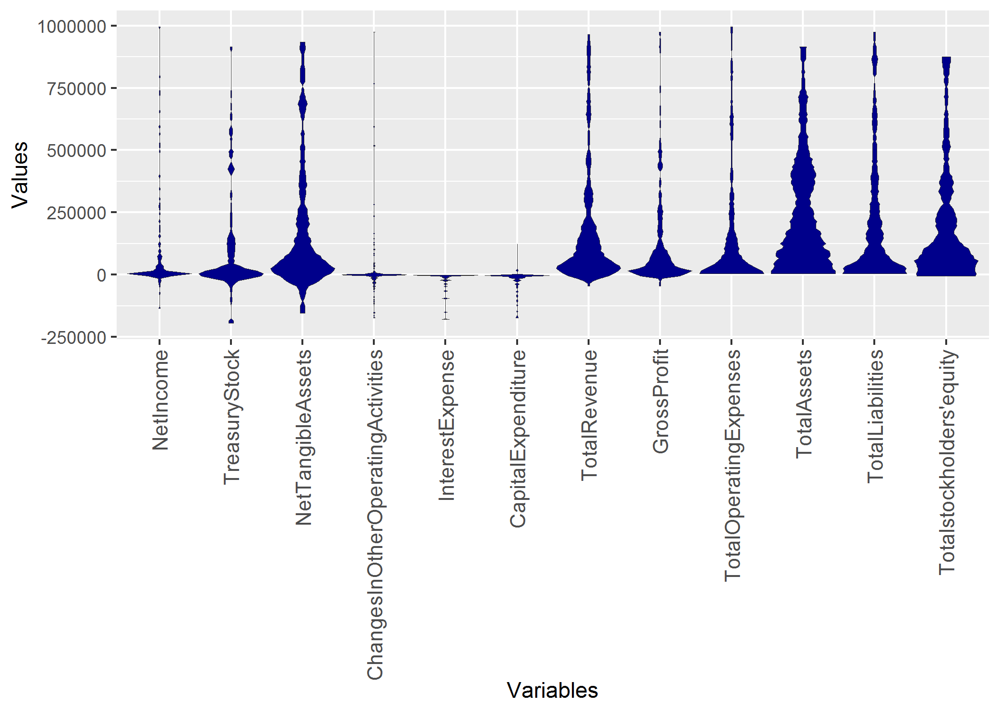
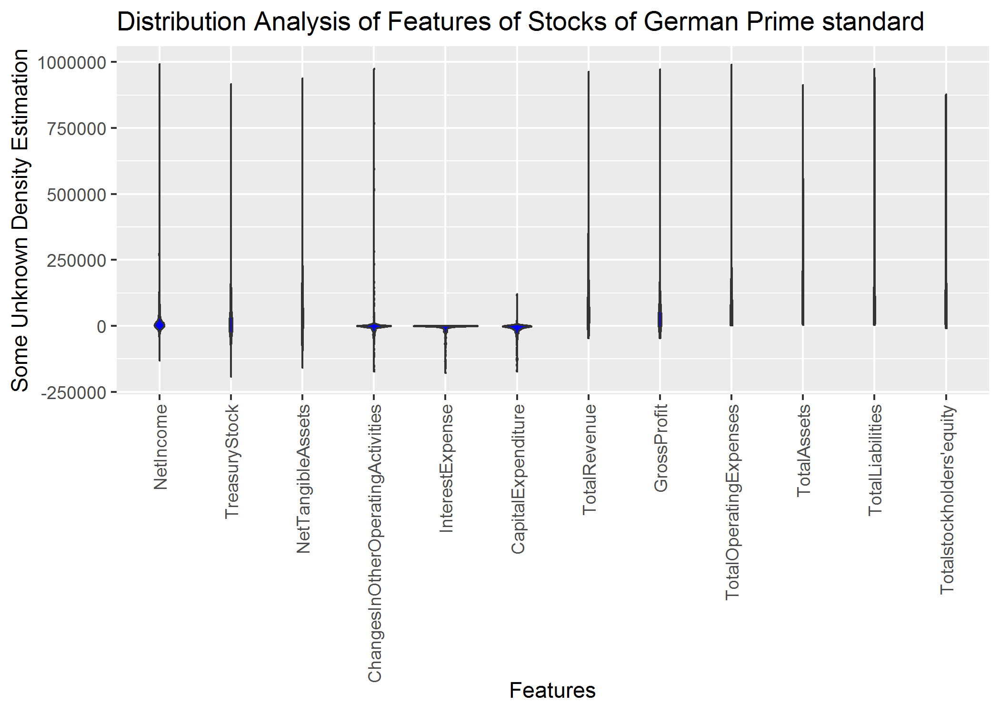
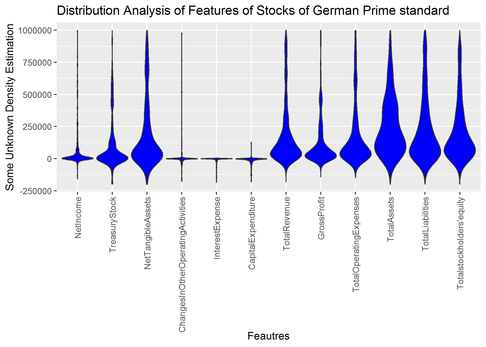

# R Tutorial

## Introduction
In data analysis of industrial topics such as the quality assurance of production facilities or the analysis of customer behavior, we constantly encounter univariate distributions of all kinds. From unimodal Gaussians to symmetric or skewed distributions to multimodal distributions It is of immense importance to determine the exact shape of the distribution in order to be able to select the correct further analysis steps and to be able to draw correct conclusions. Of special interest is the question, whether the given empirical distribution is composed of two or more distinct subsets of data points. Such subsets give hints to the existence of different states of the data producing process, such as, for example, healthy vs. sick patients or the existence of different diseases or treatments.

Conventional visualization methods of univariate probability density distributions have problems in the distinction of uniform versus multi-modal distributions and in visualizing capped skewed distributions correctly. With the mirrored density plot, a visualization method more suit-able for these applications was postulated [Thrun/Ultsch, 2019] and is currently under review in [Thrun et al., 2019].

## Basic Usage of Visualization


## Changing Layout 

## Advanced Usage

# Overlay with Robustly Estimated Gaussian Distribution

# Overlay with Box Plot

# Scaling

# Sampling

# Ordering


## Distribution Analysis of Stocks Data
The data consists of Aaccounting information of 261 companies traded in the Frankfurt stock exchange in the German Prime standard. The data set is described in [Thrun et al., 2019]. Here, we use the third quarter instead the first, but the result remains the same because the same features are selected.


```r
library(DataVisualizations)
library(ggplot2)
data('AccountingInformation_PrimeStandard_Q3_2019')
str(AI_PS_Q3_2019)
Data=AI_PS_Q3_2019$Data

targets=c('NetIncome','TreasuryStock','NetTangibleAssets',
          'ChangesInOtherOperatingActivities',
          'InterestExpense',
          'CapitalExpenditure','TotalRevenue',
          'GrossProfit','TotalOperatingExpenses',
          'TotalAssets','TotalLiabilities',
          "Totalstockholders'equity")
ind=match(table = colnames(Data),targets)

MDplot(Data[,ind],Ordering = 'Columnwise')+ylim(-200000,1000000)
#ggsave(filename='MDplot_stocksdata.png')
```


## Comparison to Violin plot of ggplot2
Of course the usual violin plot of ggplot2 does not have all the features of the MD plot. Additionally, we did not compare with the ggplot in our publication ([Thrun et al., 2019]) because we were unable to find out how the density is estimated in ggplot2.
The main point here is, that the usual density estimation is sometimes incorrect:

```r
library(ggplot2)
dataframe = reshape2::melt(Data[,ind])
colnames(dataframe) <- c('ID', 'Variables', 'Values')
plot =ggplot(data = dataframe,
             aes_string(x = "Variables", group = "Variables", y = "Values"))+ylim(-200000,1000000)
plot=plot + geom_violin(fill="blue")
plot+ggtitle('Distribution Analysis of Features of Stocks of German Prime standard')+xlab('Feautres')+ylab('Some Unknown Density Estimation')+ggExtra::rotateTextX()  
#ggsave(filename='ggplot1_stocksdata.png')
```

Setting the parameters manually can result in an incorrect estimation of the probability density function (pdf). 

```r
plot =ggplot(data = dataframe,
             aes_string(x = "Variables", group = "Variables", y = "Values"))+ylim(-200000,1000000)
plot=plot + geom_violin(fill="blue",scale = "width",trim=FALSE)
plot+ggtitle('Distribution Analysis of Features of Stocks of German Prime standard')+xlab('Feautres')+ylab('Some Unknown Density Estimation')+ggExtra::rotateTextX() 
#ggsave(filename='ggplot2_stocksdata.png')
```


Correct parameter setting still results in an inferior visualization because multimodality is not visible:

```r
plot =ggplot(data = dataframe,
             aes_string(x = "Variables", group = "Variables", y = "Values"))+ylim(-200000,1000000)
plot=plot + geom_violin(fill="blue",scale = "width",trim=TRUE)
plot+ggtitle('Distribution Analysis of Features of Stocks of German Prime standard')+xlab('Feautres')+ylab('Some Unknown Density Estimation')+ggExtra::rotateTextX()  
#ggsave(filename='ggplot3_stocksdata.png')
```


In sum, the density estimation of ggplot2 requires the setting of parameters which is in an exploratice approach not feasible. MD plot does not require the setting of paramters for the estimation of the pdf. However, the user can use additional features of MD plot like automatic transformation of variables or distinguishing gaussian from non-gaussian distributions.

[Thrun/Ultsch, 2019] Thrun, M. C., & Ultsch, A.: Analyzing the Fine Structure of Distributions, Technical Report of the University of Marburg, 2019.

[Thrun et al., 2019] Thrun, M. C., Gehlert, T., & Ultsch, A.: Analyzing the Fine Structure of Distributions, PloS one,  under review, preprint available at arXiv:1908.06081, 2019. 
